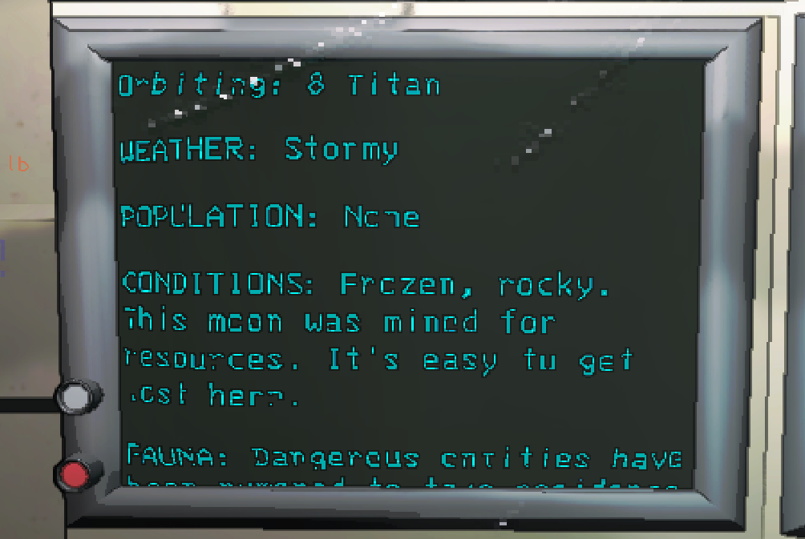
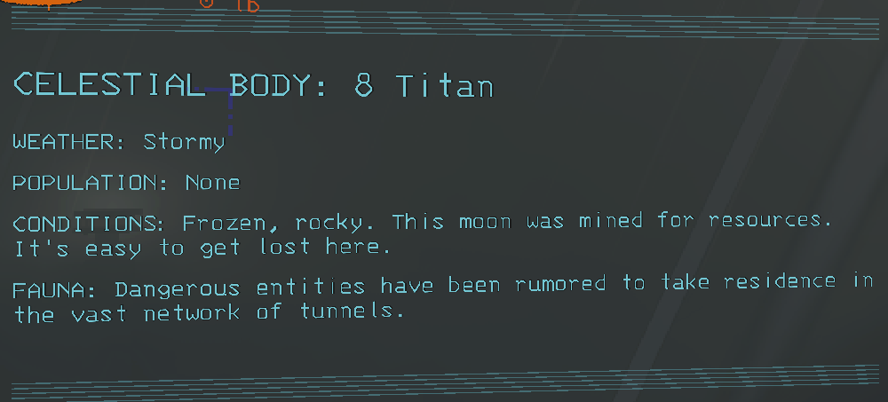

# SimpleWeatherDisplay
Adds a very simple weather display to the ship screen and landing sequence.

By default this mod moves the weather display to the *top* of the moon information so its always visible, capitalizes it to fit in better, and makes it show clear weather too. Individual aspects can be configured, as well as whether it applies to the ship screen / landing sequence.

Ship screen:

Landing sequence:
